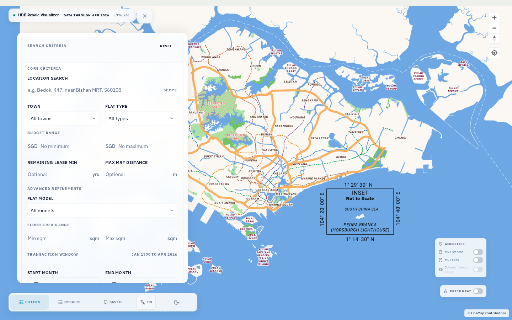
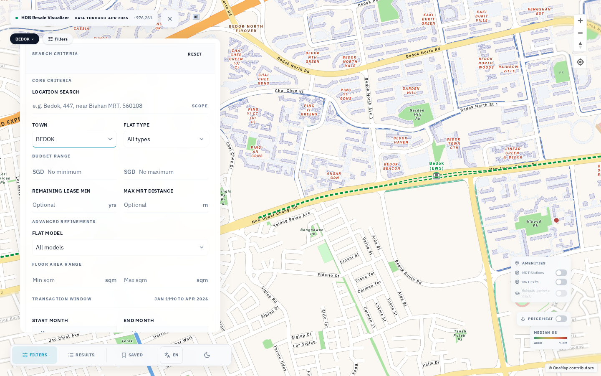
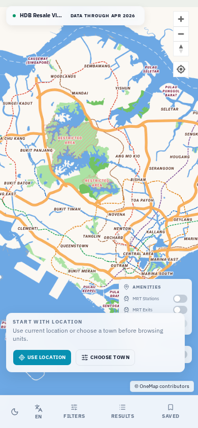
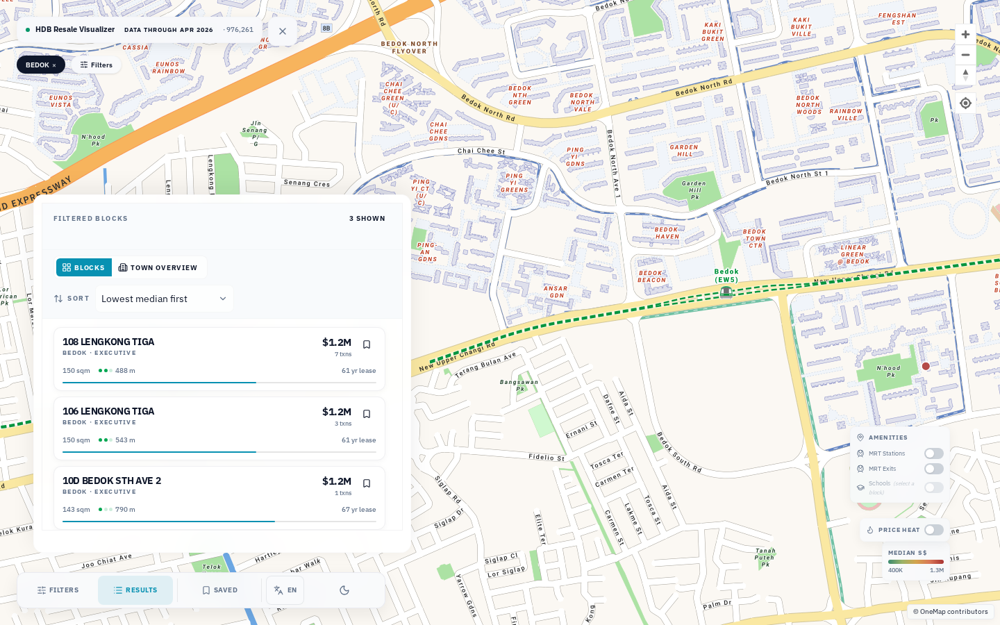
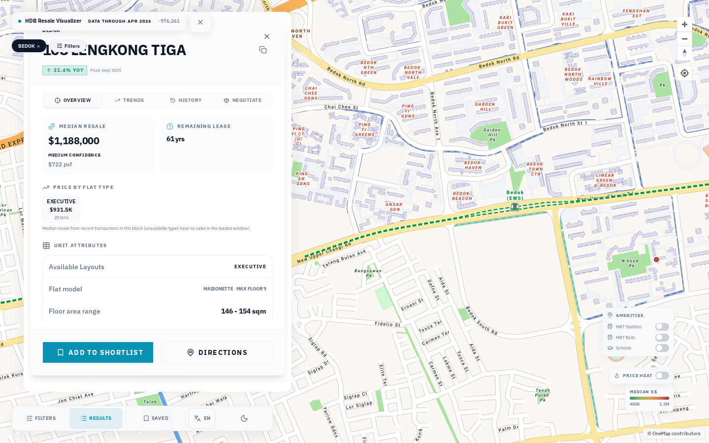
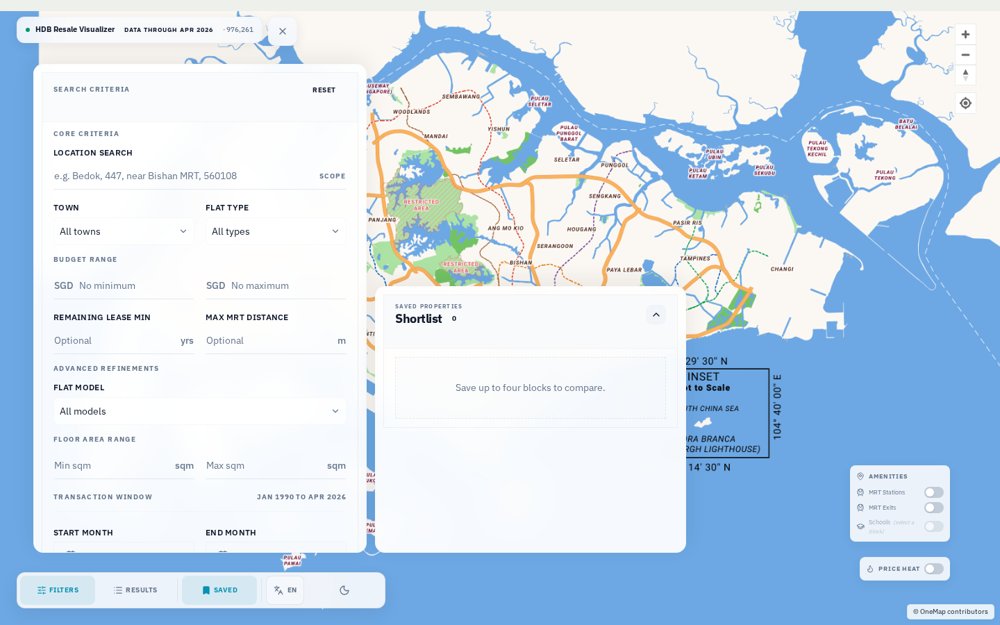

> **Note for AI Agents:** Please read `AGENTS.md` before proposing or making any changes to this repository to ensure architecture and data pipeline invariants are strictly preserved.

# HDB Resale Visualizer

Map-first Singapore HDB resale explorer built for real buying decisions, not price prediction. The app uses official public datasets, precomputes static artifacts, and serves a fast client-only UI on Cloudflare Pages.

## Stack

- Vite + React 19 + TypeScript
- MapLibre GL JS with OneMap GreyLite tiles
- Shadcn-style card and list primitives for block results and shortlist comparison
- ECharts for block-level trend charts
- Node.js 26 + npm for package management, scripts, and CI

## Kiro workflow and repository docs

This repo uses Kiro-style steering and specs. The canonical project intelligence lives in `.kiro/`:

- [`.kiro/steering/`](.kiro/steering/) — persistent product + architectural rules
- [`.kiro/powers/`](.kiro/powers/) — tool capability and workflow bundles
- [`.kiro/specs/`](.kiro/specs/) — active or historical feature/bug workstreams

Historical working notes are kept in [`docs/archive/`](docs/archive/) (non-canonical).

Top-level Markdown keeps one canonical instruction source ([`AGENTS.md`](AGENTS.md)) and optional model-specific entrypoints ([`CLAUDE.md`](CLAUDE.md), [`GEMINI.md`](GEMINI.md)) that redirect to the same Kiro guidance.

## Screenshots

| Overview | Filtered by town |
|---|---|
|  |  |

| Mobile view | Results list |
|---|---|
|  |  |

| Block detail | Shortlist |
|---|---|
|  |  |

## What it does

- Visualizes resale blocks as address points on a Singapore map
- Filters by town, flat type, flat model, budget, floor area, lease year, date window, and MRT distance
- Shows block-level median pricing, recent transactions, and 12–24 month price trends
- Overlays MRT stations, MRT exits, schools, hawker centres, supermarkets, and parks as toggleable amenity layers
- Price heatmap mode colors the map by median $/sqm for at-a-glance comparisons
- Budget match badges highlight blocks within your target range
- Block detail drawer shows lease remaining, floor area range, transaction history, and a trend chart
- Stores a browser-local shortlist with per-block notes and target prices
- Keeps the frontend 100% static by precomputing all JSON artifacts at build time

## Official data sources

- [Resale Flat Prices collection 189](https://data.gov.sg/datasets?agencies=Housing+%26+Development+Board+(HDB)&resultId=189)
- [HDB Property Information](https://data.gov.sg/datasets/d_17f5382f26140b1fdae0ba2ef6239d2f/view)
- [LTA MRT Station Exit (GEOJSON)](https://data.gov.sg/datasets/d_b39d3a0871985372d7e1637193335da5/view)
- [MOE School Directory](https://data.gov.sg/datasets/d_688b934f82c1059ed0a6993d2a829089/view)
- [NEA Hawker Centre Directory](https://data.gov.sg/datasets/d_4a086da0a5553be1d89383cd90d07ecd/view)
- [SFA Licensed Supermarkets](https://data.gov.sg/datasets/d_11edd0117280c5776651d7891114c88c/view)
- [NParks Parks and Nature Reserves](https://data.gov.sg/datasets/d_0542d48f0991541706b58059381a6eca/view)
- [data.gov.sg API docs](https://guide.data.gov.sg/developer-guide/api-overview)
- [OneMap basemap docs](https://www.onemap.gov.sg/docs/maps/greylite.html)

## Local development

Install dependencies:

```bash
npm install
```

For normal local development and automated tests, copy the checked-in fixture snapshot into `public/data/` (this directory is gitignored and empty by default):

```bash
npm run setup:fixtures
```

Run `npm run sync-data` only when you intentionally want to refresh artifacts from the live data.gov.sg and OneMap APIs (requires network access and optional API keys; see [Environment](#environment)).

Start the app:

```bash
npm run dev
```

Open `http://localhost:5173`.

## Scripts

```bash
npm run dev
npm run check:boundaries
npm run check:data
npm run build
npm run build:full
npm run preview
npm run typecheck
npm run lint
npm run lint:fast
npm run test
npm run test:e2e
npm run sync-data
```


## Build and runtime guardrails

To keep the static-data architecture enforceable as the codebase evolves, CI and local production builds run two mandatory checks before compiling:

- `npm run check:boundaries` validates that any Node-executed code in `scripts/` stays isolated from runtime `src/` modules and does not use runtime-only aliases like `@/` and `@shared/`.
- `npm run check:data` validates that required generated artifacts are present before static build output is produced.

`npm run build` is the default fixture-backed production build path (`check:boundaries` + `check:data` + compile + bundle budget check).

`npm run build:full` is the live-refresh path for maintainers intentionally pulling fresh upstream data (`check:boundaries` + `sync-data` + compile + bundle budget check).

## Data pipeline

`scripts/sync-data.ts` does the following:

1. Reads the HDB resale collection metadata from data.gov.sg.
2. Downloads CSV and GEOJSON source files for resale prices, properties, MRT stations, schools, hawker centres, supermarkets, and parks through the official dataset download API.
3. Validates raw rows with `zod`.
4. Normalizes addresses, prices, lease values, and monthly aggregates.
5. Resolves block and amenity coordinates through OneMap and caches them in `data/cache/geocodes.json` (preserved across CI runs via GitHub Actions cache; not tracked by git).
6. Computes nearest MRT distance from LTA station exit points.
7. Emits:
   - `public/data/manifest.json`
   - `public/data/block-summaries.json`
   - `public/data/trends/town-flat-type.json` (monthly medians, median $/sqm, and transaction counts by town × flat type)
   - `public/data/mrt-stations.geojson` and `mrt-exits.geojson`
   - `public/data/details/` (individual block transaction history and trend data)
   - `public/data/comparisons/` (amenity proximity counts and percentile ranks, when amenity data is available)

## Environment

Optional environment variables:

```bash
DATA_GOV_API_KEY=...
ONEMAP_SEARCH_ENDPOINT=https://www.onemap.gov.sg/api/common/elastic/search
GEOCODE_CONCURRENCY=10
```

`DATA_GOV_API_KEY` is recommended for production refresh jobs because unauthenticated data.gov.sg rate limits are low.

## Deployment

- Cloudflare Pages publishes the static `dist/` output using the Wrangler CLI from GitHub Actions (`wrangler pages deploy dist --project-name=...`); there is no committed `wrangler.toml` in this repository.
- `.github/workflows/ci.yml` runs typecheck, typed lint, unit/integration tests, e2e smoke, and fixture-backed production build verification.
- `.github/workflows/deploy-preview.yml` handles build, pipeline cache/data sync, and Cloudflare Pages preview/production deploy after CI passes.
- `.github/workflows/refresh-data.yml` runs nightly in SGT-equivalent UTC time, refreshes datasets, and deploys directly to Cloudflare Pages when the relevant secrets exist. Artifacts are never committed to git.

## Notes

- This is not a prediction product.
- Coordinates are resolved during artifact generation, never in the browser.
- OneMap attribution must remain visible when the map is rendered.

## Troubleshooting

### `npm run build` fails on boundary violations

`check:boundaries` fails when build-time modules import from `src/` (directly or transitively) or use Vite runtime aliases inside Node execution paths. Move shared logic to `shared/` and import from there in both runtime and script codepaths.

### Map fails to render in browser

The map initialization hook treats WebGL/context/shader failures as fatal renderer errors and surfaces a user-facing `mapError` state instead of leaving a broken map instance mounted. Typical causes are unsupported browsers, blocked GPU acceleration, or unstable graphics drivers.
